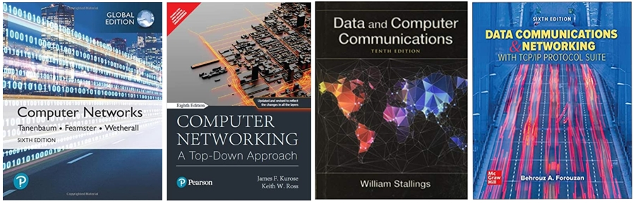

# **Computer Networks I**

> **Computer Systems Networks (I), Supervisor: Dr. Siavash Rajabi**

> ***CE/EE Departments of Hamedan University of Technology***

> **Course Material by [Siavash Rajabi](https://scholar.google.com/citations?user=QhTEvqsAAAAJ), and [Mr. Ali Mohammadpour](https://github.com/alimpk)**

## Synopsis
Welcome to Computer Networks I, under-graduate course. ! Here you will find friendly slides, small codes, and projects designed specfically for teach and learn applied computer networks.

## Course Material

## Refrences

1. **Computer Networks**, 5th Edition,Andrew S. Tanenbaum, and David J. Wetherall, 2010
 

2. **Computer Networking: A Top-Down Approach**, 8th Edition, Jim Kurose, and Keith Ross, 2021
 

3. **Data and Computer Communications**, 10th Edition, William Stallings, 2019
 

4. **Data Communications and Networking with TCP/IP Protocol Suite**, 5th Edition, Behrouz A. Forouzan, 2021
 
   

  

# Course Outline

* **Introduction, Protocols and Layering**
    * Goals and Motivation
    * Network uses
    * Network components
    * Sockets
    * Trace route
    * Protocol layers
    * Reference models
    * Internet history

* **Physical Layer**
    * Media
    * Signal
    * Modulation
    * limits

* **Data Link Layer**
    * Framing
    * Error detection and correction
    * Retransmition (ARQ)
    * Multiplexing
    * Random Access
    * Wireless Access
    * Switches

* **Network Layer**
    * Network Services
    * Internetworking
    * IP Prefixes
    * IP forwarding
    * IPv4 and IPv6

* **Routing**
    * Shortest Path Routing
    * Computing Shortest Paths
    * Distance Vector Routing
    * Flooding

* **Transport Layer, Reliable Transport**
    * Connection Establishment
    * Connection Release
    * Sliding Windows
    * Flow Control
    * Transmission Control Protocol (TCP)

# Quick Start

* The `archive` directory contains all of non-common course materials for last semesters, you can use them for more practices.
* The `material` directory contains all course learning/teaching/materials
* The `assignment` directory contains all of Problem Sets and Assignments that has template design files.
* The `samples` directory is contains all of sample cores for subjects.
